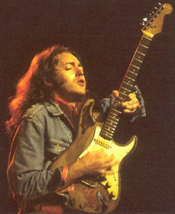
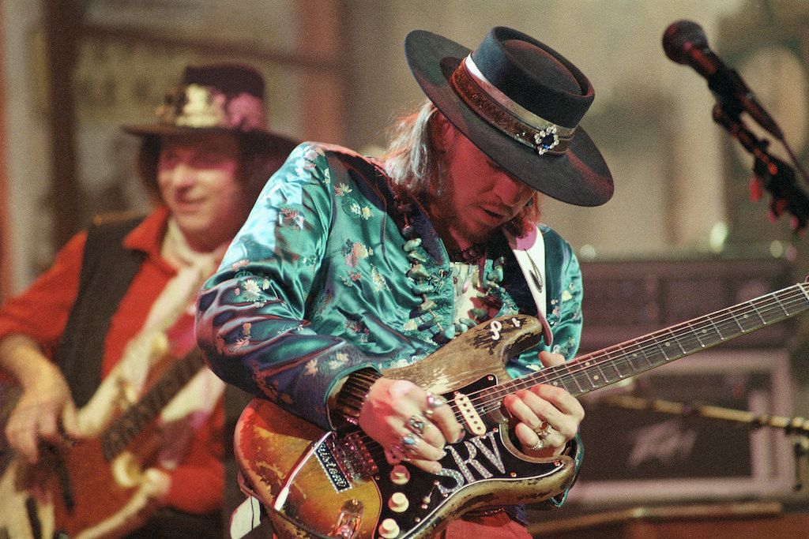

George Leal

Lab: Introduction to Markdown

10/03/23

# Basic HTML Elements in Markdown

*Markdown is very interesting to use*, considering that you don't 
really have to use **syntax** to code a web page.

>I am currently learning the pentatonic scale on my guitar!

>I currently have two guitars and another on the way!
> 1. I have an Epiphone Les Paul Custom in black with white trim
> 2. I have a Yamaha Acoustic Guitar in black
> 3. I am currently waiting for my parts to arrive, I am building a relic'd partscaster!

>These two guitars are the inspiration of the body of my guitar! It should arrive in a couple of weeks!

